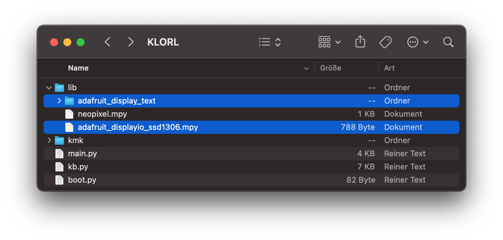

# Setup OLED

!!! tip "tl;dr"
        Add libraries to your keyboard, set `:::py klor_oled = True` and customize your OLED text
## Add the necessary libraries
In order to use OLEDs you have to install two libraries into your keyboard's `'lib'` folder:

=== "Github Releases"
    You can find the necessary libraries included in the [`klor_kmk_firmware.zip` release](https://github.com/moritz-john/kmk-config-klor/releases)

    1. Copy the **folder** called `'adafruit_display_text'` and the **file** called `'adafruit_displayio_ssd1306.mpy'` out of `'klor_kmk_firmware/lib'`
    2. Paste the file into the `'lib'` folder on your microcontroller
    3. Repeat for your other keyboard half

=== "Locate & exctract files yourself" 
    Download: [adafruit-circuitpython-bundle-8.x-mpy-YYYYMMDD.zip](https://github.com/adafruit/Adafruit_CircuitPython_Bundle/releases/)

    1. Copy the **folder** called `'adafruit_display_text'` and the **file** called `'adafruit_displayio_ssd1306.mpy'` out of `'adafruit-circuitpython-bundle-7.x-mpy-YYYYMMDD/lib/'`
    2. Paste the file into the `'lib'` folder on your microcontroller
    3. Repeat for your other keyboard half

{ width="700"}

## Activate the OLED code
Afterwards you have to change the variable `klor_oled` from `False` to `True` in your [`main.py`](https://github.com/moritz-john/kmk-config-klor/blob/master/firmware/main.py) file:

```python
klor_variant = "saegewerk"
klor_rgb = "none"         
klor_oled = False          #<- Change this to True
klor_speaker = False      
```

## Customize your OLED text
When you add more layers to your keymap, also add them to this part your OLED code.

*You can find the code in your [`kb.py`](https://github.com/moritz-john/kmk-config-klor/blob/master/firmware/kb.py) file:*

```python hl_lines="9 13 17" title="Example: adding a fourth layer called 'TESTLAYER' to the OLED code:"
oled_ext = Oled(
    OledData(
        corner_one={
            0: OledReactionType.STATIC,
            1: ["Layer"],
        },
        corner_two={
            0: OledReactionType.LAYER,
            1: ["0", "1", "2", "3"],
        },
        corner_three={
            0: OledReactionType.LAYER,
            1: ["BASE", "RAISE", "LOWER", "TESTLAYER"],
        },
        corner_four={
            0: OledReactionType.LAYER,
            1: ["qwerty", "nums", "sym", "test"],
        },
    ),
    toDisplay=OledDisplayMode.TXT,
    flip=True,
    # oHeight=64,
) 
```

## Possible Tweaks
The `'SSD1306 128x64 pixel OLED Displays'` is not offically supported by KMK, only the `'128x32 pixel'` version is.

If you want to display photos on your OLED as per [this instructions](https://github.com/KMKfw/kmk_firmware/blob/master/docs/en/peg_oled_display.md#photos) you might need to uncomment `# oHeight=64,` in the OLED code block. 

!!! warning
    Displaying photos on the KLOR's OLED has not been tested and might require additonal code changes.

If you uncomment `# oHeight=64,` while displaying [text](https://github.com/KMKfw/kmk_firmware/blob/master/docs/en/peg_oled_display.md#text) the font becomes smaller, so you can display more words, but everything is moved to the top left corner. 